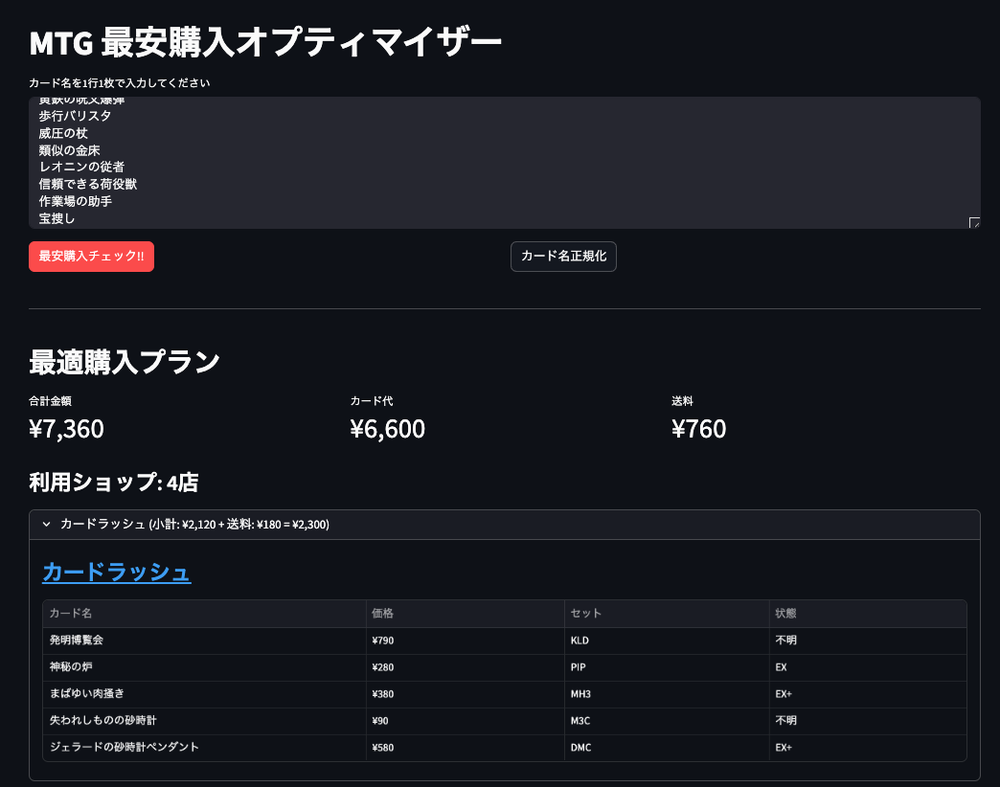

# guild-bargain

MTG カードの最安購入プランを提案するツール。CLI と Web UI (Streamlit) の両方で使える。

欲しいカードのリストを入力すると、[Wisdom Guild](https://wonder.wisdom-guild.net/) から各ショップの価格を取得し、**送料を考慮した最安の買い方**を計算する。

## 特徴

- **送料込みで最安** — PuLP（ILP ソルバー）が送料無料ラインも考慮して厳密に最適化
- **カード名の自動修正** — Claude CLI が表記揺れ・記号抜けを正規化（例: 「皆に命を」→「皆に命を！」）
- **購入アドバイス** — Claude CLI が代替プランやコスト削減のレコメンドを生成

## スクリーンショット



## 必要なもの

- Python 3.10+
- [Claude Code](https://docs.anthropic.com/en/docs/claude-code) CLI（カード名正規化・アドバイス生成に使用）

## セットアップ

```bash
./setup.sh
```

## 使い方

### Web UI（Streamlit）

```bash
./run.sh
```

ブラウザが開くので、テキストエリアにカード名を1行1枚で入力して「最適化」ボタンを押す。

サイドバーで Claude CLI によるカード名正規化・購入アドバイス生成の ON/OFF を切り替えられる。

### CLI

#### 1. 欲しいカードを `cards.txt` に書く

```
最後の夜を一緒に
密輸人の驚き
皆に命を
テフェリーの防御
```

1 行 1 カード名。日本語名・英語名どちらでも OK。

#### 2. 実行

```bash
python3 main.py
```

#### 3. 出力例

```
== Step 1: カード名を正規化中 ==
  以下のカード名を修正しました:
    皆に命を → 皆に命を！

== Step 2: 価格情報を取得中 ==
  [1/4] 最後の夜を一緒に ... 20 件
  [2/4] 密輸人の驚き ... 20 件
  [3/4] 皆に命を！ ... 11 件
  [4/4] テフェリーの防御 ... 20 件

== Step 3: 最適化計算中 ==

==================================================
最適購入プラン
==================================================
合計: 5525円 (カード代: 4925円 + 送料: 600円)
利用ショップ数: 2店

■ BLACK FROG (小計: 4725円 + 送料: 400円 = 5125円)
  - 最後の夜を一緒に  63円
  - 皆に命を！  1782円
  - テフェリーの防御  2880円

■ トレトク (小計: 200円 + 送料: 200円 = 400円)
  - 密輸人の驚き  200円

== Step 4: アドバイスを生成中 ==
（Claude CLI による代替プラン・コスト削減レコメンド）
```

#### オプション

| オプション | 説明 |
|-----------|------|
| `--no-advice` | Claude CLI の呼び出しをスキップ（正規化・アドバイス生成なし） |
| `-c FILE` | カードリストファイルを指定（デフォルト: `cards.txt`） |
| `-s FILE` | 送料ルールファイルを指定（デフォルト: `shops.json`） |

## 送料ルール（shops.json）

主要店舗の送料を手動管理する。未知の店舗には `_default` が適用される。

```json
{
  "晴れる屋": { "shipping": 180, "free_threshold": 30000 },
  "カードラッシュ": { "shipping": 180, "free_threshold": 5000 },
  "トレトク": { "shipping": 200, "free_threshold": 5000 },
  "駿河屋": { "shipping": 440, "free_threshold": 1500 },
  "_default": { "shipping": 400, "free_threshold": null }
}
```

- `shipping`: 基本送料（円）
- `free_threshold`: この金額以上で送料無料（`null` = 送料無料なし）

## 仕組み

1. **カード名正規化**（Claude CLI） — 表記揺れを修正して Wisdom Guild で確実に検索できるようにする
2. **スクレイピング**（requests + BeautifulSoup） — Wisdom Guild から各カードのショップ別価格・在庫を取得
3. **最適化**（PuLP ILP） — 「カード代 + 送料」の合計を最小化する購入プランを厳密計算
4. **アドバイス生成**（Claude CLI） — 最適解の説明、代替プラン、コスト削減レコメンドを生成

## ファイル構成

```
guild-bargain/
├── app.py             # Web UI (Streamlit)
├── main.py            # CLI エントリポイント
├── normalizer.py      # Claude CLI でカード名を正規化
├── scraper.py         # Wisdom Guild スクレイピング
├── solver.py          # PuLP による最適化ソルバー
├── advisor.py         # Claude CLI で説明・レコメンド生成
├── cards.txt          # 欲しいカードリスト
├── shops.json         # 送料ルール
├── requirements.txt   # Python 依存パッケージ
├── setup.sh           # セットアップスクリプト
└── run.sh             # Web UI 起動スクリプト
```
